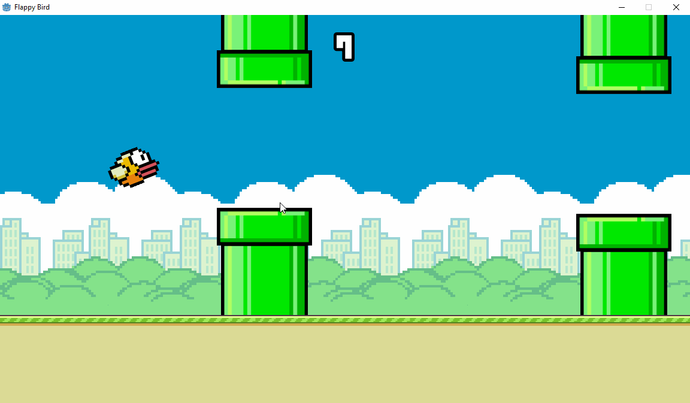

# Flappy Bird

## Summary
This is a recreation of the mobile game 'Flappy Bird'. The aim of the game is to fly the bird through as many pipes as possible, without crashing into the pipes 

I created this game as an introduction to Godot, a game engine that I am learning.

## Features
 - A bird that can flap its wings to move up, and automatically falls.
 - Pipes with random heights
 - Collision detection ends the game
 - A points system that also keeps track of your high score in a binary file

## How To Play (Currently only on windows)
 - Look at the releases section of this repository
 - Download the .exe file from the most recent release
 - Run the executable file

## Upcoming Features
 - Different coloured birds to play as
 - Pipes speed up as score increases